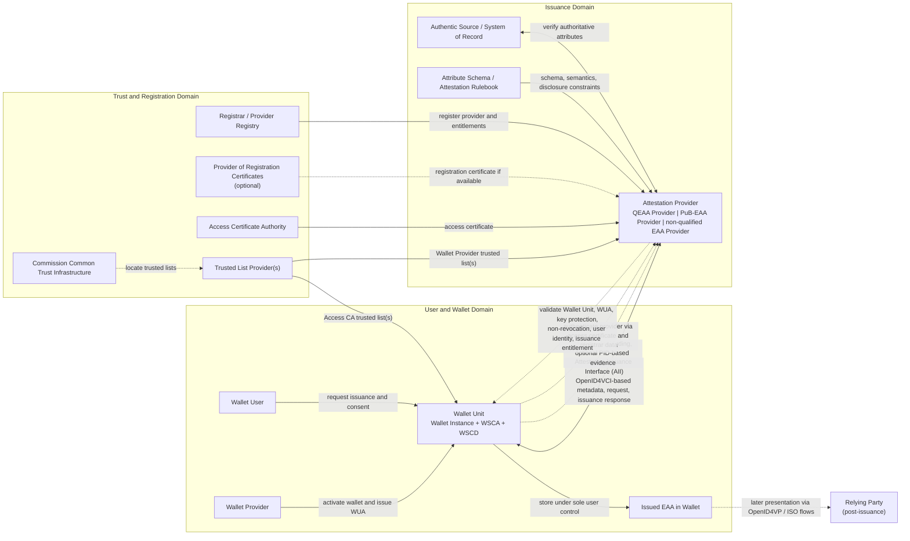

# EUDI Wallet EAA Issuance Reference Architecture

Status: synthesis artifact
Date: 2026-04-27
Purpose: depict a standards-aligned reference architecture for issuing an Electronic Attestation of Attributes (EAA) into a European Digital Identity Wallet.

## Scope

This diagram models issuance into a Wallet Unit.
It is a reference architecture, not a Member-State-specific deployment blueprint and not a substitute for legal or conformity assessment evidence.

## Diagram

## Conformance Notes

- `Wallet Unit` is modeled with the ARF/CIR component split: `Wallet Instance`, `Wallet Secure Cryptographic Application (WSCA)`, and `Wallet Secure Cryptographic Device (WSCD)`.
- The issuance channel is the `Attestation Issuance Interface (AII)`, which the ARF aligns with `OpenID4VCI`.
- No centralised service discovery mechanism is foreseen for PID or attestation issuance; the Wallet Unit is directed to the Provider by an external trigger such as a QR code, link, or NFC tap.
- Before issuance, the Wallet Unit authenticates the Attestation Provider through its access certificate and, where relevant, registration information from a registrar or registration certificate.
- The Attestation Provider validates the Wallet Unit through the Wallet Unit Attestation (`WUA`), verifies revocation status, and checks that the attestation key is protected by the wallet cryptographic device.
- `QEAA`, `PuB-EAA`, and `non-qualified EAA` share the same technical issuance shape, but differ in legal role and entitlement validation.
- `QEAA` is issued by a `QTSP`; `PuB-EAA` is issued by or on behalf of a public sector body responsible for an authentic source; `non-qualified EAA` is issued by a non-qualified trust service provider.
- The ARF notes that trusted lists may also exist for `non-qualified EAA` providers, but their treatment is out of scope of the ARF.
- EAAs issued to Wallet Units should use one of the standardised attestation formats recognized by the framework; this is explicitly required for `QEAA` and `PuB-EAA` issuance through Commission Implementing Regulation (EU) 2025/1569 with reference to Annex II of Commission Implementing Regulation (EU) 2024/2979.
- The `Authentic Source` link is especially important where issuer-side verification of authoritative attributes is required.

## Sources

- [EUDI Wallet ARF 2.4.0](https://eudi.dev/2.4.0/architecture-and-reference-framework-main/)
- [Commission Implementing Regulation (EU) 2024/2977](https://eur-lex.europa.eu/eli/reg_impl/2024/2977/oj/eng)
- [Commission Implementing Regulation (EU) 2024/2979](https://eur-lex.europa.eu/eli/reg_impl/2024/2979/oj/eng)
- [Commission Implementing Regulation (EU) 2024/2980](https://eur-lex.europa.eu/eli/reg_impl/2024/2980/oj/eng)
- [Commission Implementing Regulation (EU) 2025/1569](https://eur-lex.europa.eu/eli/reg_impl/2025/1569/oj/eng)
